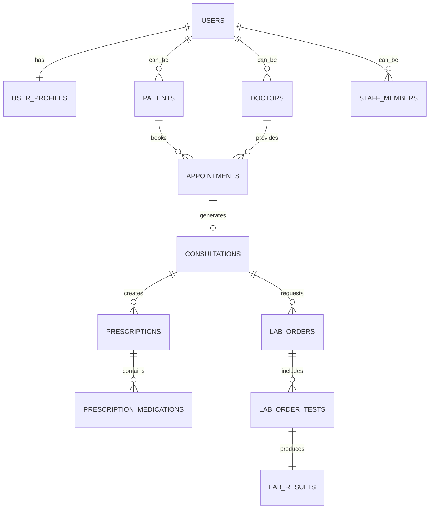

# 🏥 Comprehensive Digital Healthcare Platform Architecture

## 📋 Table of Contents
1. [System Overview](#system-overview)
2. [Architecture Patterns](#architecture-patterns)
3. [Technology Stack](#technology-stack)
4. [Module Breakdown](#module-breakdown)
5. [Security & Compliance](#security--compliance)
6. [Phased Development Plan](#phased-development-plan)
7. [Database Design](#database-design)
8. [API Design](#api-design)
9. [Integration Strategy](#integration-strategy)
10. [Deployment & Scaling](#deployment--scaling)

## 🎯 System Overview

### Vision
A comprehensive digital healthcare platform serving all stakeholders in the public health ecosystem, from patients to policymakers, with role-based access, real-time data synchronization, and advanced analytics.

### Core Principles
- **Patient-Centric**: Every feature prioritizes patient safety and experience
- **Interoperability**: HL7/FHIR compliance for seamless data exchange
- **Security First**: End-to-end encryption, HIPAA/GDPR compliance
- **Scalability**: Microservices architecture supporting millions of users
- **Accessibility**: Multi-language, offline-capable, mobile-first design

## 🏗️ Architecture Patterns

### 1. Microservices Architecture
```
┌─────────────────────────────────────────────────────────────┐
│                    API Gateway                              │
│              (Kong/AWS API Gateway)                         │
└─────────────────┬───────────────────────────────────────────┘
                  │
    ┌─────────────┼─────────────┐
    │             │             │
┌───▼───┐    ┌───▼───┐    ┌───▼───┐
│Patient│    │Doctor │    │Admin  │
│Service│    │Service│    │Service│
└───────┘    └───────┘    └───────┘
    │             │             │
┌───▼───┐    ┌───▼───┐    ┌───▼───┐
│Pharmacy│   │Lab    │    │Analytics│
│Service │   │Service│    │Service  │
└───────┘    └───────┘    └───────┘
```

### 2. Event-Driven Architecture
- **Event Bus**: Apache Kafka/Redis Streams
- **Event Types**: PatientRegistered, AppointmentBooked, PrescriptionIssued, etc.
- **Benefits**: Loose coupling, real-time updates, audit trails

### 3. CQRS (Command Query Responsibility Segregation)
- **Write Models**: Optimized for transactions
- **Read Models**: Optimized for queries and reporting
- **Benefits**: Better performance, scalability, and separation of concerns

## 🛠️ Technology Stack

### Frontend Stack
```typescript
// Web Portal (Next.js 14+)
- Framework: Next.js with App Router
- Language: TypeScript
- Styling: Tailwind CSS + shadcn/ui
- State Management: Zustand + React Query
- Forms: React Hook Form + Zod validation
- Charts: Recharts/Chart.js
- Real-time: Socket.io client

// Mobile App (React Native)
- Framework: React Native + Expo
- Navigation: React Navigation v6
- State: Redux Toolkit + RTK Query
- UI: NativeBase/Tamagui
- Offline: Redux Persist + SQLite
```

### Backend Stack
```typescript
// API Services (Node.js)
- Runtime: Node.js 20+ with TypeScript
- Framework: Express.js/Fastify
- Validation: Zod/Joi
- Authentication: NextAuth.js/Passport.js
- File Upload: Multer + Sharp
- PDF Generation: Puppeteer/jsPDF
- Real-time: Socket.io
- Testing: Jest + Supertest
```

### Database Stack
```sql
-- Primary Database: PostgreSQL 15+
- ACID compliance for critical healthcare data
- JSON support for flexible schemas
- Full-text search capabilities
- Row Level Security (RLS)

-- Search Engine: ElasticSearch
- Fast patient/medication lookup
- Analytics and reporting
- Log aggregation

-- Cache Layer: Redis
- Session management
- Frequently accessed data
- Real-time notifications
```

### Infrastructure
```yaml
# Cloud Services (AWS/Azure/GCP)
Compute: 
  - Web: Vercel/Netlify
  - API: AWS ECS/Lambda
  - Mobile: Expo Application Services

Storage:
  - Files: AWS S3/Azure Blob
  - Database: AWS RDS/Supabase
  - Cache: AWS ElastiCache

Security:
  - WAF: AWS WAF/Cloudflare
  - Secrets: AWS Secrets Manager
  - Monitoring: DataDog/New Relic
```

## 📦 Module Breakdown

### 1. Patient Management Module
**Features:**
- Patient registration and profile management
- Medical history tracking
- Family health records
- Insurance information
- Emergency contacts

**API Endpoints:**
```typescript
POST /api/patients/register
GET /api/patients/:id/profile
PUT /api/patients/:id/profile
GET /api/patients/:id/medical-history
POST /api/patients/:id/family-members
```

### 2. Appointment Management Module
**Features:**
- Doctor availability calendar
- Appointment booking and rescheduling
- Telemedicine integration
- Automated reminders
- Queue management

**API Endpoints:**
```typescript
GET /api/doctors/:id/availability
POST /api/appointments/book
PUT /api/appointments/:id/reschedule
GET /api/appointments/patient/:patientId
POST /api/appointments/:id/telemedicine-link
```

### 3. Electronic Health Records (EHR) Module
**Features:**
- Consultation notes
- Diagnosis and treatment plans
- Prescription management
- Lab results integration
- Document management

**API Endpoints:**
```typescript
POST /api/consultations
GET /api/consultations/patient/:patientId
POST /api/prescriptions
GET /api/prescriptions/:id/medications
PUT /api/prescriptions/:id/dispense
```

### 4. Laboratory Management Module
**Features:**
- Test ordering system
- Sample tracking
- Result reporting
- Quality control
- Equipment management

**API Endpoints:**
```typescript
POST /api/lab-orders
GET /api/lab-orders/:id/tests
POST /api/lab-results
GET /api/lab-results/patient/:patientId
PUT /api/lab-orders/:id/status
```

### 5. Pharmacy Management Module
**Features:**
- Inventory management
- Prescription dispensing
- Stock alerts and expiry tracking
- Sales reporting
- Supplier management

**API Endpoints:**
```typescript
GET /api/inventory/medications
POST /api/inventory/stock-update
GET /api/prescriptions/pending-dispensing
POST /api/pharmacy-sales
GET /api/inventory/low-stock-alerts
```

### 6. Staff Management Module
**Features:**
- Staff scheduling
- Role-based access control
- Performance tracking
- Payroll integration
- Communication tools

**API Endpoints:**
```typescript
POST /api/staff/schedule
GET /api/staff/:id/shifts
PUT /api/staff/:id/role-permissions
GET /api/staff/performance-metrics
POST /api/staff/internal-messages
```

### 7. Analytics & Reporting Module
**Features:**
- Patient flow analytics
- Disease surveillance
- Resource utilization
- Financial reporting
- Predictive analytics

**API Endpoints:**
```typescript
GET /api/analytics/patient-flow
GET /api/analytics/disease-trends
GET /api/analytics/resource-utilization
GET /api/reports/financial/:period
GET /api/analytics/predictive/stock-requirements
```

## 🔒 Security & Compliance

### Authentication & Authorization
```typescript
// Multi-factor Authentication
interface AuthConfig {
  mfa: {
    required: boolean;
    methods: ['sms', 'email', 'authenticator'];
  };
  sessionTimeout: number;
  passwordPolicy: {
    minLength: 12;
    requireSpecialChars: true;
    requireNumbers: true;
    requireUppercase: true;
  };
}

// Role-Based Access Control (RBAC)
enum Permission {
  READ_PATIENT_DATA = 'read:patient_data',
  WRITE_PATIENT_DATA = 'write:patient_data',
  PRESCRIBE_MEDICATION = 'prescribe:medication',
  ACCESS_LAB_RESULTS = 'access:lab_results',
  MANAGE_INVENTORY = 'manage:inventory',
  VIEW_ANALYTICS = 'view:analytics',
  ADMIN_USERS = 'admin:users'
}
```

### Data Protection
- **Encryption at Rest**: AES-256 for database and file storage
- **Encryption in Transit**: TLS 1.3 for all communications
- **Data Anonymization**: Automated PII removal for analytics
- **Backup Strategy**: Encrypted daily backups with 7-year retention

### Compliance Framework
- **HIPAA Compliance**: Business Associate Agreements, audit logs
- **GDPR Compliance**: Data portability, right to be forgotten
- **SOC 2 Type II**: Security, availability, processing integrity
- **HL7 FHIR R4**: Healthcare data interoperability standard

## 🚀 Phased Development Plan

### Phase 1: MVP (Months 1-4)
**Priority Modules:**
1. **User Authentication & Profiles** ✅
2. **Patient Registration & Basic EHR** ✅
3. **Appointment Booking System** ✅
4. **Doctor Dashboard** ✅
5. **Basic Prescription Management** ✅

**Success Metrics:**
- 100 concurrent users
- <2s page load times
- 99.9% uptime
- Basic RBAC implementation

### Phase 2: Core Healthcare (Months 5-8)
**New Modules:**
1. **Laboratory Management System**
2. **Pharmacy & Inventory Management**
3. **Telemedicine Integration**
4. **Mobile Applications**
5. **Basic Analytics Dashboard**

**Enhancements:**
- Advanced search functionality
- Real-time notifications
- Document upload/management
- Integration with external labs

### Phase 3: Advanced Features (Months 9-12)
**New Modules:**
1. **Nursing Care Management**
2. **Facility Management**
3. **Procurement System**
4. **Advanced Analytics & AI**
5. **Public Health Surveillance**

**Enhancements:**
- IoT device integration
- Predictive analytics
- Advanced reporting
- Multi-language support

### Phase 4: Scale & Optimize (Months 13-18)
**Focus Areas:**
1. **Performance Optimization**
2. **Advanced Security Features**
3. **Third-party Integrations**
4. **AI-powered Insights**
5. **Compliance Certifications**

## 🗄️ Database Design

### Core Entities Relationship


### Data Partitioning Strategy
```sql
-- Partition large tables by date for better performance
CREATE TABLE consultations_2024 PARTITION OF consultations
FOR VALUES FROM ('2024-01-01') TO ('2025-01-01');

-- Partition audit logs by month
CREATE TABLE audit_logs_202401 PARTITION OF audit_logs
FOR VALUES FROM ('2024-01-01') TO ('2024-02-01');
```

## 🔌 API Design

### RESTful API Standards
```typescript
// Consistent response format
interface ApiResponse<T> {
  success: boolean;
  data?: T;
  error?: {
    code: string;
    message: string;
    details?: any;
  };
  meta?: {
    pagination?: PaginationMeta;
    timestamp: string;
    version: string;
  };
}

// Standardized error codes
enum ErrorCode {
  VALIDATION_ERROR = 'VALIDATION_ERROR',
  UNAUTHORIZED = 'UNAUTHORIZED',
  FORBIDDEN = 'FORBIDDEN',
  NOT_FOUND = 'NOT_FOUND',
  RATE_LIMIT_EXCEEDED = 'RATE_LIMIT_EXCEEDED',
  INTERNAL_ERROR = 'INTERNAL_ERROR'
}
```

### GraphQL for Complex Queries
```graphql
type Patient {
  id: ID!
  profile: UserProfile!
  medicalHistory: [Consultation!]!
  prescriptions: [Prescription!]!
  labResults: [LabResult!]!
  appointments(status: AppointmentStatus): [Appointment!]!
}

query GetPatientDashboard($patientId: ID!) {
  patient(id: $patientId) {
    profile {
      firstName
      lastName
      dateOfBirth
    }
    appointments(status: SCHEDULED) {
      id
      scheduledAt
      doctor {
        profile {
          firstName
          lastName
        }
        specialization
      }
    }
    prescriptions(limit: 5) {
      id
      medications {
        name
        dosage
        frequency
      }
      isDispensed
    }
  }
}
```

## 🔗 Integration Strategy

### Healthcare Standards Compliance
```typescript
// HL7 FHIR R4 Patient Resource
interface FHIRPatient {
  resourceType: 'Patient';
  id: string;
  identifier: Identifier[];
  name: HumanName[];
  telecom: ContactPoint[];
  gender: 'male' | 'female' | 'other' | 'unknown';
  birthDate: string;
  address: Address[];
  contact: PatientContact[];
}

// Convert internal patient to FHIR format
function toFHIRPatient(patient: Patient): FHIRPatient {
  return {
    resourceType: 'Patient',
    id: patient.id,
    identifier: [
      {
        system: 'https://hospital.gov/patient-id',
        value: patient.patientId
      }
    ],
    name: [
      {
        family: patient.profile.lastName,
        given: [patient.profile.firstName]
      }
    ],
    // ... additional mappings
  };
}
```

### External System Integrations
```typescript
// Insurance Provider Integration
interface InsuranceClaimRequest {
  patientId: string;
  providerId: string;
  serviceDate: string;
  diagnosis: string[];
  procedures: string[];
  amount: number;
}

// Laboratory Integration
interface ExternalLabOrder {
  orderId: string;
  patientId: string;
  tests: string[];
  priority: 'routine' | 'urgent' | 'stat';
  clinicalInfo: string;
}

// Telemedicine Integration
interface TelemedicineSession {
  appointmentId: string;
  patientId: string;
  doctorId: string;
  sessionUrl: string;
  startTime: Date;
  duration: number;
}
```

## 🚀 Deployment & Scaling

### Container Strategy
```dockerfile
# Multi-stage build for production optimization
FROM node:20-alpine AS builder
WORKDIR /app
COPY package*.json ./
RUN npm ci --only=production

FROM node:20-alpine AS production
WORKDIR /app
COPY --from=builder /app/node_modules ./node_modules
COPY . .
EXPOSE 3000
CMD ["npm", "start"]
```

### Kubernetes Deployment
```yaml
apiVersion: apps/v1
kind: Deployment
metadata:
  name: healthcare-api
spec:
  replicas: 3
  selector:
    matchLabels:
      app: healthcare-api
  template:
    metadata:
      labels:
        app: healthcare-api
    spec:
      containers:
      - name: api
        image: healthcare-platform:latest
        ports:
        - containerPort: 3000
        env:
        - name: DATABASE_URL
          valueFrom:
            secretKeyRef:
              name: db-secret
              key: connection-string
        resources:
          requests:
            memory: "256Mi"
            cpu: "250m"
          limits:
            memory: "512Mi"
            cpu: "500m"
```

### Auto-scaling Configuration
```yaml
apiVersion: autoscaling/v2
kind: HorizontalPodAutoscaler
metadata:
  name: healthcare-api-hpa
spec:
  scaleTargetRef:
    apiVersion: apps/v1
    kind: Deployment
    name: healthcare-api
  minReplicas: 3
  maxReplicas: 20
  metrics:
  - type: Resource
    resource:
      name: cpu
      target:
        type: Utilization
        averageUtilization: 70
  - type: Resource
    resource:
      name: memory
      target:
        type: Utilization
        averageUtilization: 80
```

## 📊 Monitoring & Observability

### Application Monitoring
```typescript
// Custom metrics for healthcare-specific KPIs
const metrics = {
  appointmentBookingTime: histogram({
    name: 'appointment_booking_duration_seconds',
    help: 'Time taken to book an appointment',
    buckets: [0.1, 0.5, 1, 2, 5]
  }),
  
  prescriptionProcessingTime: histogram({
    name: 'prescription_processing_duration_seconds',
    help: 'Time taken to process a prescription',
    buckets: [1, 5, 10, 30, 60]
  }),
  
  patientWaitTime: histogram({
    name: 'patient_wait_time_minutes',
    help: 'Average patient wait time',
    buckets: [5, 10, 15, 30, 45, 60]
  })
};
```

### Health Checks
```typescript
// Comprehensive health check endpoint
app.get('/health', async (req, res) => {
  const healthCheck = {
    uptime: process.uptime(),
    timestamp: Date.now(),
    status: 'OK',
    services: {
      database: await checkDatabaseHealth(),
      redis: await checkRedisHealth(),
      externalAPIs: await checkExternalServices()
    }
  };
  
  const isHealthy = Object.values(healthCheck.services)
    .every(service => service.status === 'healthy');
  
  res.status(isHealthy ? 200 : 503).json(healthCheck);
});
```

## 🎯 Success Metrics & KPIs

### Technical Metrics
- **Performance**: <2s page load, <500ms API response
- **Availability**: 99.99% uptime
- **Scalability**: Support 10,000+ concurrent users
- **Security**: Zero data breaches, <1% failed logins

### Business Metrics
- **Patient Satisfaction**: >4.5/5 rating
- **Staff Efficiency**: 30% reduction in administrative tasks
- **Cost Savings**: 25% reduction in operational costs
- **Compliance**: 100% audit pass rate

### Healthcare-Specific Metrics
- **Appointment No-show Rate**: <10%
- **Prescription Error Rate**: <0.1%
- **Lab Result Turnaround**: <24 hours
- **Emergency Response Time**: <5 minutes

---

## 🎉 Conclusion

This comprehensive architecture provides a solid foundation for building a world-class digital healthcare platform. The phased approach ensures rapid delivery of value while maintaining high quality and security standards.

**Next Steps:**
1. Set up development environment
2. Implement MVP modules
3. Establish CI/CD pipeline
4. Begin user testing and feedback collection
5. Scale based on real-world usage patterns

The platform is designed to evolve with changing healthcare needs while maintaining the highest standards of security, compliance, and user experience. 